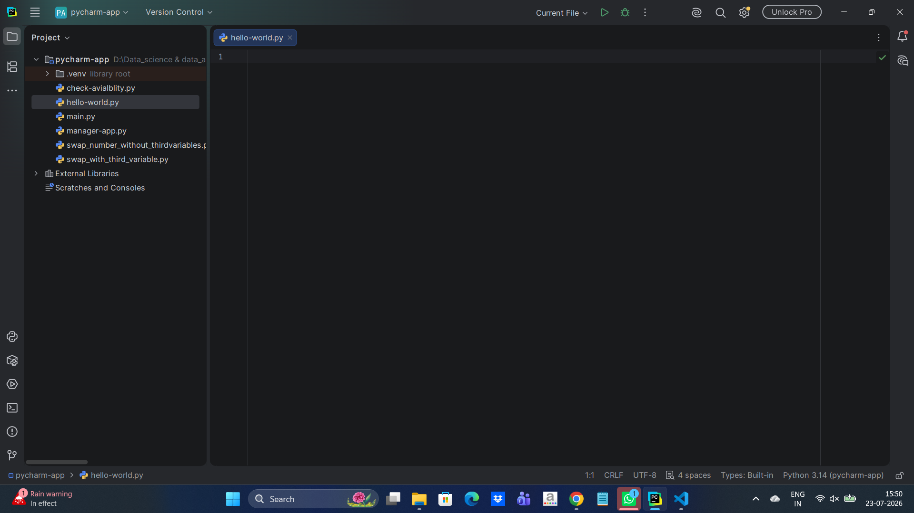
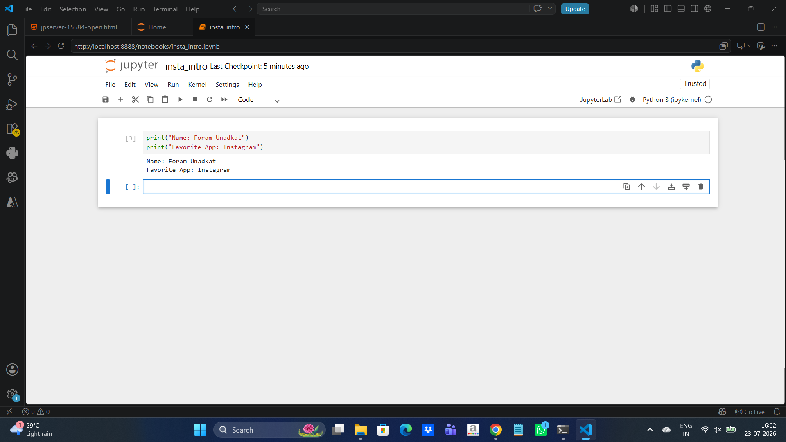
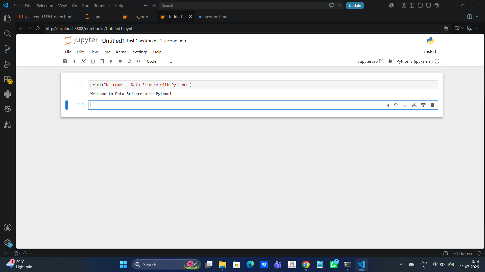
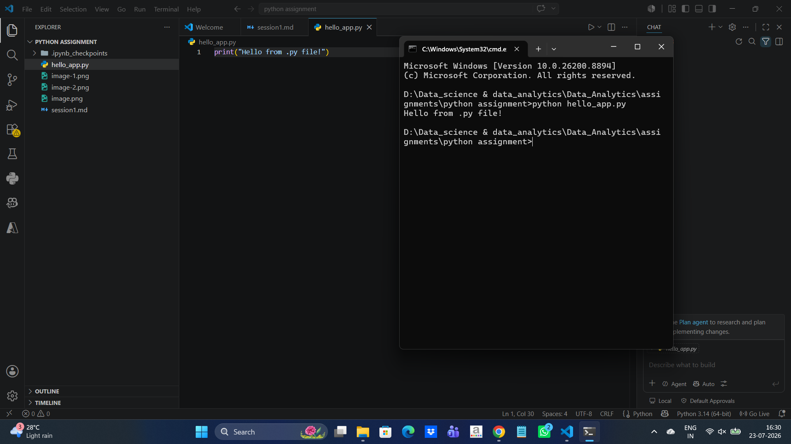

1. Install Anaconda on your system and launch Jupyter Notebook from the Anaconda Navigator.

2. Create a new Jupyter Notebook file named insta_intro.ipynb and write a cell that prints your name and your favorite app (like Instagram or Zomato) using the print() function.

3. In Jupyter Notebook, add a new cell and write Python code to print the message: 'Welcome to Data Science with Python!'.

4. Create a Python script file called hello_app.py (not a notebook) that prints 'Hello from .py file!' when run from the terminal.  <em><strong>Hint:</strong> Use a text editor like VS Code or Notepad to create the file, then run it using the command: python hello_app.py</em>

