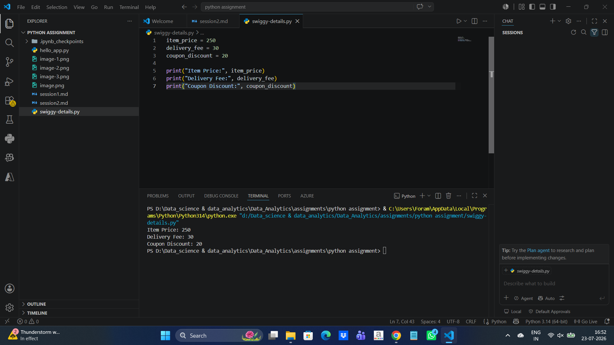
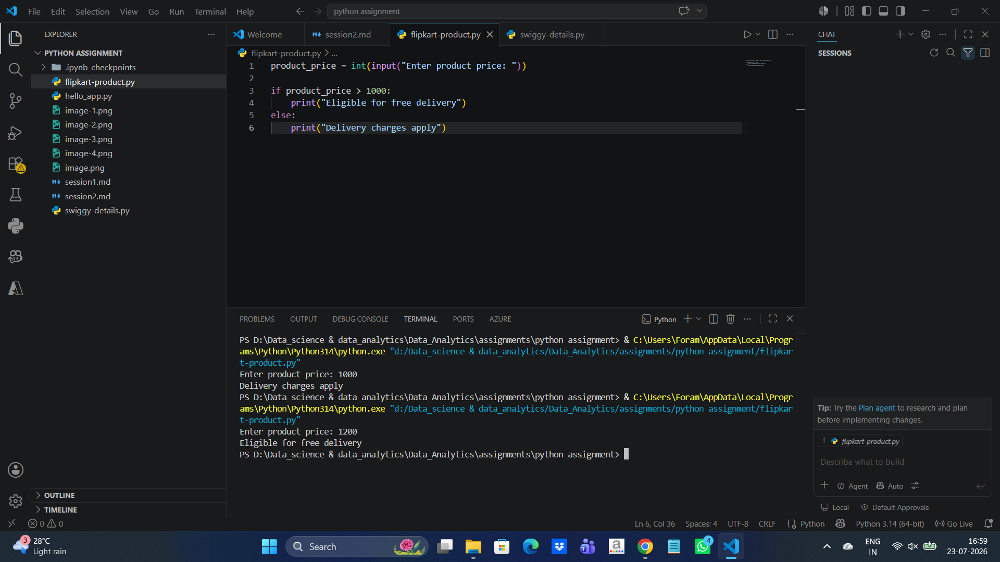
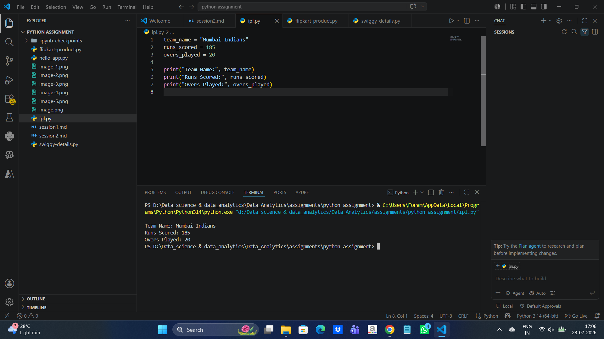

1. Create three variables in Python named item_price, delivery_fee, and coupon_discount, and assign them values representing a Swiggy order (e.g., 250, 30, 20). Print each variable.

2. Write a Python script that uses indentation correctly to check if a Flipkart product's price is above 1000; if yes, print 'Eligible for free delivery', else print 'Delivery charges apply'.  <em><strong>Hint:</strong> Use an if-else block and make sure your indentation is consistent.</em>

3. Add both single-line and multi-line comments in your script explaining what each section does, using # for single-line and triple quotes for multi-line comments.

#This is a single-line comment.

"""
This is a multi-line comment.
It can span multiple lines.
"""

4. Create variables for an IPL match: team_name, runs_scored, and overs_played. Assign appropriate values and print them using the correct naming conventions for Python variables.  <em><strong>Constraint:</strong> Use snake_case for all variable names.</em>

