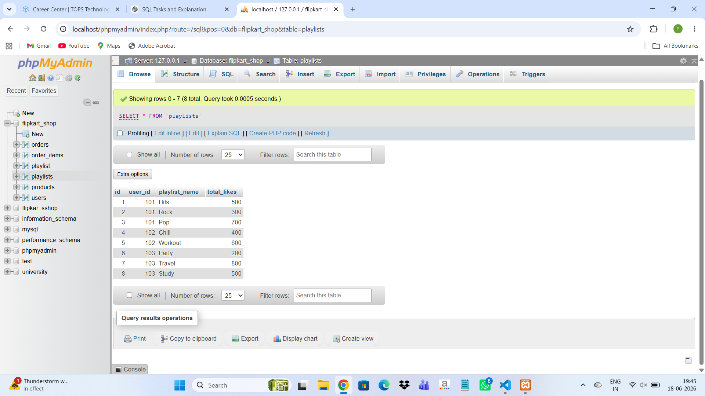

1. Create a table named Playlists with columns: id, user_id, playlist_name, and total_likes. Insert at least 8 sample rows with different users and playlists, making sure some playlists have the same user_id.

```
CREATE TABLE Playlists (
 id INT,
 user_id INT,
 playlist_name VARCHAR(50),
 total_likes INT
);
```



2. Write a SQL query using ROW_NUMBER() and the OVER() clause to assign a unique row number to each playlist, ordered by total_likes in descending order.

```
SELECT playlist_name, total_likes,
ROW_NUMBER() OVER(ORDER BY total_likes DESC) AS row_no
FROM Playlists;
```

3. Use the RANK() function with the OVER() clause to rank all playlists by total_likes, and display the playlist_name, user_id, total_likes, and their rank.

```
SELECT playlist_name, user_id, total_likes,
RANK() OVER(ORDER BY total_likes DESC) AS rnk
FROM Playlists;
```

4. Write a SQL query using DENSE_RANK() and PARTITION BY user_id to rank each user's playlists by total_likes, showing playlist_name, user_id, total_likes, and dense rank.<br><br><em><strong>Hint:</strong> This will show how popular each playlist is within each user's account, similar to how Spotify might rank your top playlists.</em>

```
SELECT playlist_name, user_id, total_likes,
DENSE_RANK() OVER(
PARTITION BY user_id
ORDER BY total_likes DESC
) AS drnk
FROM Playlists;
```

5. Imagine you want to show the top 2 playlists per user based on total_likes, like Spotify's 'Your Top Playlists' feature. Write a query using a window function to select only the top 2 playlists for each user.

```
WITH T AS (
SELECT *,
ROW_NUMBER() OVER(
PARTITION BY user_id
ORDER BY total_likes DESC
) rn
FROM Playlists
)
SELECT * FROM T
WHERE rn <= 2;
```
