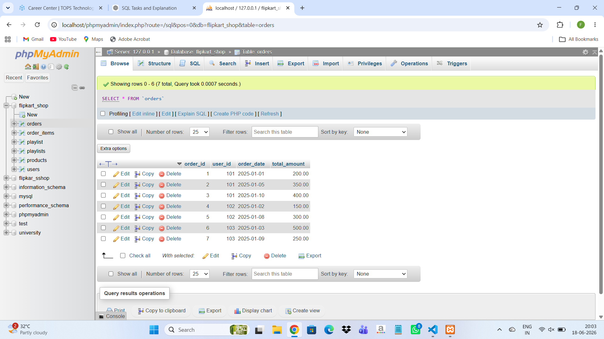

1. Create a table called Order with columns: order_id, user_id, order_date, and total_amount. Insert at least 7 sample rows representing different users and dates, similar to how food orders appear in Zomato or Swiggy.

```
CREATE TABLE Order(
 order_id INT,
 user_id INT,
 order_date DATE,
 total_amount DECIMAL(10,2)
);
```




2. Write a SQL query using the LAG() function to show each user's order_id, order_date, and the total_amount of their previous order (if any), ordered by user and date.<br><br><em><strong>Hint:</strong> Use PARTITION BY user_id and ORDER BY order_date in your window function.</em>

```
SELECT order_id,user_id,order_date,total_amount,
LAG(total_amount) OVER(
PARTITION BY user_id
ORDER BY order_date
) AS prev_amount
FROM Orders;
```

3. Using the same Orders table, write a SQL query with the LEAD() function to display each order_id, order_date, and the next order's total_amount for the same user.

```
SELECT order_id,user_id,order_date,total_amount,
LEAD(total_amount) OVER(
PARTITION BY user_id
ORDER BY order_date
) AS next_amount
FROM Orders;
```

4. Write a SQL query to calculate the running total of total_amount for each user, showing order_id, order_date, total_amount, and a column running_total that accumulates the sum as you move through each user's orders.<br><br><em><strong>Hint:</strong> Use SUM(total_amount) OVER (PARTITION BY user_id ORDER BY order_date ROWS BETWEEN UNBOUNDED PRECEDING AND CURRENT ROW).</em>

```
SELECT order_id,user_id,order_date,total_amount,
SUM(total_amount) OVER(
PARTITION BY user_id
ORDER BY order_date
) AS running_total
FROM Orders;
```

5. Write a SQL query to calculate a 3-order moving average of total_amount for each user, showing order_id, order_date, total_amount, and moving_avg columns.<br><br><em><strong>Constraint:</strong> Use SUM() OVER() with ROWS BETWEEN 2 PRECEDING AND CURRENT ROW to compute the moving average.</em>

```
SELECT order_id,user_id,order_date,total_amount,
AVG(total_amount) OVER(
PARTITION BY user_id
ORDER BY order_date
ROWS BETWEEN 2 PRECEDING AND CURRENT ROW
) AS moving_avg
FROM Orders;
```