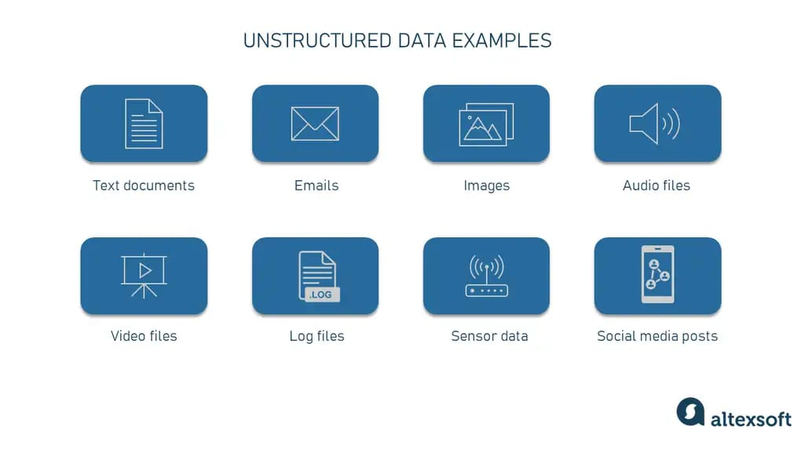
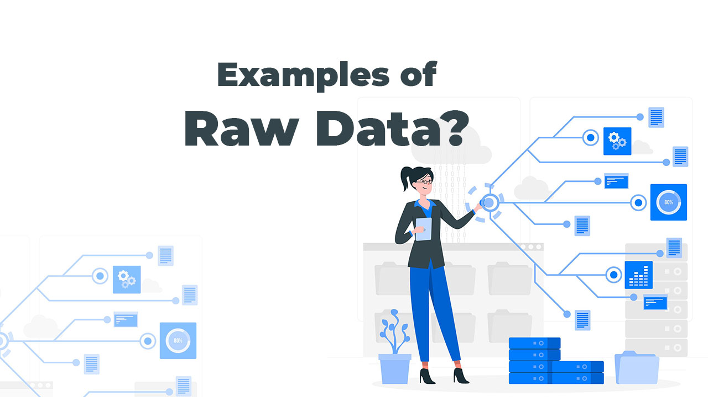

# what is data?

    1. data is a collection of information i.e called data
    2. data is an colllection of information i.e. called data

# types of data ?

    1. structured data
    2. unstructured data
    3. raw data

# what is structured data?

     1. structured data stored data in column and row i.e called structured data

    '''
        table(column * row)
        excel(column and cell)
        csv(comma seprated value)
    '''

    **example of employe table**

| Employee ID | Name         | Department       | Position               | Salary (₹) | Joining Date |
| ----------- | ------------ | ---------------- | ---------------------- | ---------- | ------------ |
| EMP001      | Aarav Patel  | IT               | Software Engineer      | 55000      | 2022-01-15   |
| EMP002      | Priya Sharma | HR               | HR Manager             | 48000      | 2021-11-20   |
| EMP003      | Rohan Mehta  | Finance          | Accountant             | 45000      | 2023-03-12   |
| EMP004      | Neha Verma   | Marketing        | Marketing Executive    | 40000      | 2022-07-08   |
| EMP005      | Karan Joshi  | IT               | Web Developer          | 52000      | 2024-02-01   |
| EMP006      | Simran Kaur  | Sales            | Sales Executive        | 38000      | 2021-09-25   |
| EMP007      | Vivek Singh  | Operations       | Operations Manager     | 60000      | 2020-06-18   |
| EMP008      | Anjali Desai | Customer Support | Support Specialist     | 35000      | 2023-08-14   |
| EMP009      | Rahul Nair   | IT               | Database Administrator | 58000      | 2022-12-05   |
| EMP010      | Meera Iyer   | Design           | UI/UX Designer         | 50000      | 2024-04-10   |

# what is unstructured data
 
    1.unstructured data stored data in format of text | audio | video | images etc i.e called unsturctured type of data

**example of unsturctured data**

'''
    music.mp3
    music.mp4
    details.txt
    live,jpeg
'''

# what is raw data format?

    1. raw data format is in json and object i.e. called raw data format

    **examples of raw data format**

    '''
        employe.json
        salary.json
        object data raw formate data
        or
        xml 
    '''
    